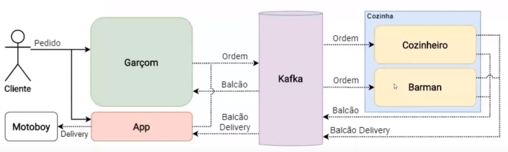

# Estudo conduzido (Projeto Restaurante)

## Kafka
Para este projeto será utilizado como ***message broker***.  
Diferencial entre outros *brokers*:
1. Kafka mantém a mensagem na fila, por um tempo determinado, mesmo que a mensagem já tenha sido lida/consumida;
2. Velocidade de processamento de mensagens;
3. Mantém histórico (stateful) caso caia o serviço as mensagens continuam na fila;
4. ...

Link: [Apache Kafka](https://kafka.apache.org/uses)

### Padrão Publisher/Subscriber
No Kafka este padrão é chamado de *Producer* e *Consumer*, a fila de mensagem também tem seu nome diferente, sendo chamada de fila de tópicos (*Topic*).
O ideal é que somente haja um *Consumer* para cada *Topic* para garantir que que os dados sejam processados apenas uma vez.

#### Partições
Para paralelizar e/ou escalar o processamento do *Topic* o Kafka permite a criação de particionamento, isso permite que mais de um *Consumer* processe o mesmo *Topic*, porém apenas um *Consumer* pode ser atribuído para um particionamento. A utilização de mais de um *Consumer* inscrito no mesmo *Topic*, consumindo mensagens diferentes da mesma fila é chamada de *Consumer Group*. 
> O número máximo de *Consumers* dentro de um *Consumer Group* deve ser restrito à quantidade de particionamentos do *Topic*.

A criação de particionamento é bem simples através da interface do Kafka, porém a exclusão é complicada, pois deve se levar em consideração os dados contídos pela partição.

#### Consumer Group
O *Consumer Group* é formado por uma ou mais instâncias da mesma aplicação, ou seja, que efetuam a mesma forma de processamento dos dados. E cada *Consumer Group* 'processa TODOS os dados da fila. 
Quando houver a necessidade de utilizar mais de um *Consumer Group* para consumir o mesmo tópico, é imprescindível que o processamento dos dados seja de forma diferente (Ex.: um soma e outro multiplica).

#### Réplicas
O Kafka permite criar réplicas do *Broker* (máquina, vm, docker) que contenha as informações dos *Topics*, fazendo uma réplica sincronizada com o *Broker* que contém o dado original. O próprio Kafka gerencia e efetua as réplicas.

https://github.com/felipe-tomino/dio-restaurant/

## Javascript
